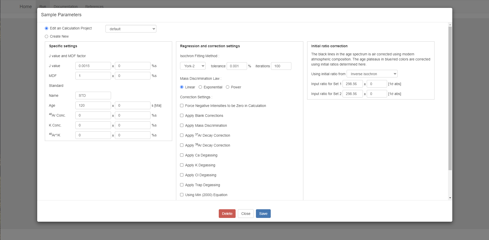

*This documentation provides guidance on how to use WebArAr.*

*Last updated: **Feb 15, 2024***

## 目录

1. [Home](#home)
2. [Import your data](#import-your-data)
3. [Setting file filter](#setting-file-filter)
4. [Setting constants set](#setting-constants-set)
5. [Setting irradiation parameters](#setting-irradiation-parameters)
6. [Setting sample information and parameters](#setting-sample-imformation-and-parameters)
7. [Data reduction and recalculaiton](#data-reduction-and-recalculation)
8. [Interact with tables](#interact-with-tables)
9. [Interact with plots](#interact-with-plots)
10. [Save and export](#save-and-export)
11. [FAQ](https://github.com/wuyangchn/webarar/issues)

## Home

## Import your data

**1. Mass Spec Raw Data**

To set file filter, see [here](#setting-file-filter)

**2. arr file (.arr)**

see [arr file example]()

**3. age file derived from ArArCALC**

.age files, see [age file example]()

**4. xls file exported from ArArCALC**

 .xls files, see [xls file example]()

**5. The current file**

The redis will save your last opened object for a while, via The Current File you can get it without uploding the file again.

**6. New**

Create an empty object and you will need to enter data in the appropriate tables. What data is required is dependant on your needs, WebArAr will do whatever it can do.

For example, if you want to plot a age speatra. Paste data into 'Apparent Age', '1σ', and '39Ar[K]%' columns in the 'Age Spectra table', then click 'Sava changes'.

Then click 'Recalcualte' and select 'Reset Plot Data' and 'Reset Figure Style' and apply.
The age spectra plot shows.

## Setting file filter

## Setting constants set

## Setting irradiation parameters

## Setting sample imformation and parameters

## Data reduction and recalculation

## Interact with tables

## Interact with plots

## Save and export

