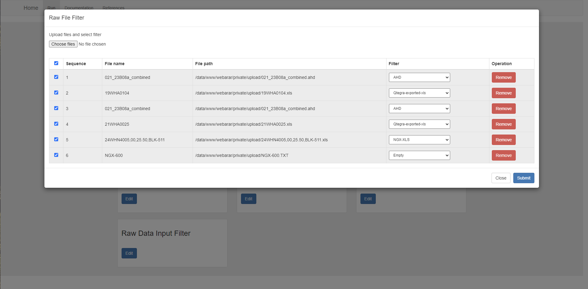
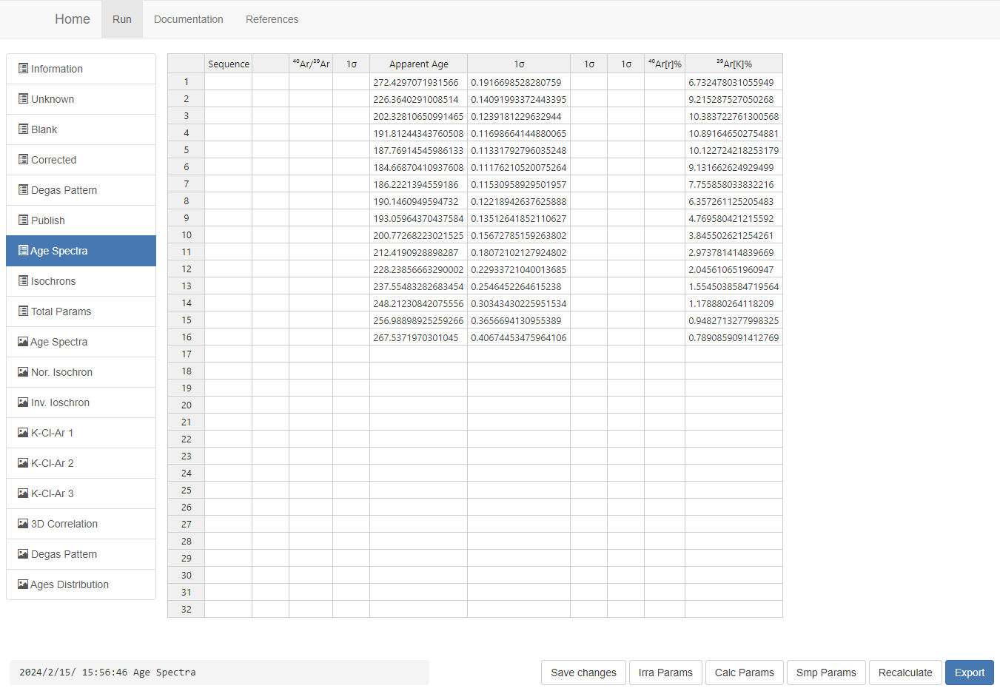
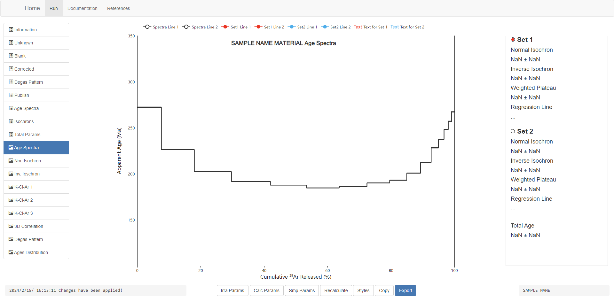

*This documentation provides guidance on how to use WebArAr.*

*Last updated: **Feb 15, 2024***

## Content

1. [General procedure](#general-procedure)
1. [Interface](#interface)
2. [Import your data](#import-your-data)
3. [Setting file filter](#setting-file-filter)
4. [Setting constants set](#setting-constants-set)
5. [Setting irradiation parameters](#setting-irradiation-parameters)
6. [Setting sample information and parameters](#setting-sample-imformation-and-parameters)
7. [Data reduction and recalculaiton](#data-reduction-and-recalculation)
8. [Interact with tables](#interact-with-tables)
9. [Interact with plots](#interact-with-plots)
10. [Save and export](#save-and-export)
11. [FAQ](https://github.com/wuyangchn/webarar/issues)

## General procedure

WebArAr will create a Sample Object for all data imported, which is essentially a instance of a Python class. Changes from users in interactive pages are sent to the server side for synchronization, and the server side sends the results of the calculations to the front end for display.

There are four ways to create a Sample Object:

1. Read from a raw data exported from a mass spec.

    - A file filter is required to read files correctly. [See here](#setting-file-filter) for how to edit a filter.

    - Raw data requires some necessary extrapolation and blank assignment. [See here](#import-from-mass-spec-raw-data) for more information.

2. Read .arr files.

    - .arr files are files exported from WebArAr as users' command. It is essentially the Sample Object after being JSON-serialized. 

    <!-- - [here is an exmaple of .arr files](/20WHA0101.arr) -->

3. Read from .age and .xls files from ArArCALC

    - .age is an extension of project files of ArArCALC.

    - .xls refers to the files exported from ArArCALC, which lost some information compared to the .age files.

    <!-- - [here is an exmaple of .arr files](/20WHA0105.age)-->

    <!--- [here is an exmaple of .xls files](/20WHA0105.age) -->

4. Create an empty object

    - Empty object require users enter data munally.

    - This is helpful for users who will just use some parts of functionalities. [See here](#create-an-empty-object) for more information on how much data is needed for a certain requirement.

Successful creation of a Sample object will take you to the object display page. The left side navigation lists the tables and figures that the object has.

Any file that is opened will no longer be associated with your local file, so any changes will not result in a loss of your local data. Also, the Sample object is passed between the server and the user in the form of stream, and is not automatically saved as a file, so all modifications will be lost when the window is closed unless the arr file is downloaded.

The operations that can be performed after opening the Sample object include:

1. Change sample information
    
    Sample information includes location, laboratory, researcher etc., which are unrelated to the calculation.

2. Edit content in tables

    All tables are editable. Munally editing and saving changes can change table contents.

    [See here]() for information on what content contained in tables.

3. Edit parameters

    - Edit manually.

        All parameters are displayed in a table named Total Params. Note: after saving changes in this table, re-calculation will not applied automatically.

    - Apply parameter set

        Open parameter setting dialogs to set parameters for all sequences. Parameter setting dialogs includes:

        - Calculation Constants, [see here](#setting-constants-set)
        - Irradiation Parameters, [see here](#setting-irradiation-parameters)
        - Special parameters for individual samples, [see here](#setting-sample-imformation-and-parameters)

4. Generic interactions for figures

    All figures are rendered by Echarts

    - Click on the top legend area to show or hide a graphical element.

    - Drag and drop to move the text position

    - Click the Style button below will bring up the style settings window on the right side. Clicking on a scatter point, line, or text element on the figure will take you to the object-specific style settings window. close or click style again to hide the style settings window.

5. Scatter point selection for isochrons

    WebArAr provides five isochrones, including normal, inverse isochrones, and three isochrones related to Chlorine. All isochrones and age spectrum plots will use the same combination of selection, and up tp two combinations of picks are supported.

    Click on Set1 and Set2 on the right side to toggle the current combination, Set1 is in red and Set2 is in blue, and click on the scatter point to select or unselect the point. Each click will automatically recalculate the regression and age. The response speed depends on the network speed. For smooth operation, you can press and hold Ctrl and then continually click on scatter points, after which you need to call a re-calculation.

## Interface

*Home Page*

*Import Data Page*

*Object Page*

*Tables*

*Figures*

## Import your data

## Import from mass spec raw data

To set file filter, see [here](#setting-file-filter)

## Open arr file

see [arr file example](22WHA0433.arr)

## Import from ArArCALC

.age files, see [age file example](22WHA0433.age)

.xls files, see [xls file example]()

## The current file

The redis will save your last opened object for a while, via The Current File you can get it without uploding the file again.

## Create an empty object

Create an empty object and you will need to enter data in the appropriate tables. What data is required is dependant on your needs, WebArAr will do whatever it can do.

For example, if you want to plot a age speatra. Paste data into 'Apparent Age', '1σ', and '39Ar[K]%' columns in the 'Age Spectra table', then click 'Sava changes'.

Then click 'Recalcualte' and select 'Reset Plot Data' and 'Reset Figure Style' and apply.
The age spectra plot shows.

## Setting file filter

## Setting constants set

## Setting irradiation parameters

## Setting sample imformation and parameters

## Data reduction and recalculation

## Interact with tables

## Interact with plots

## Save and export

