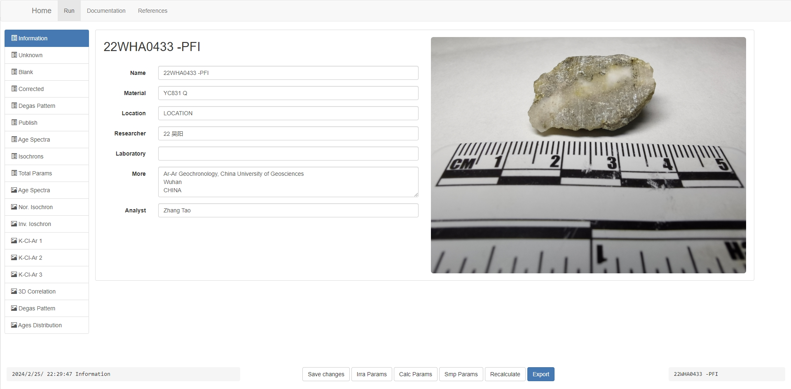
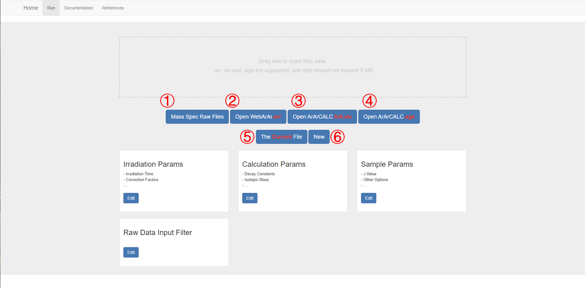
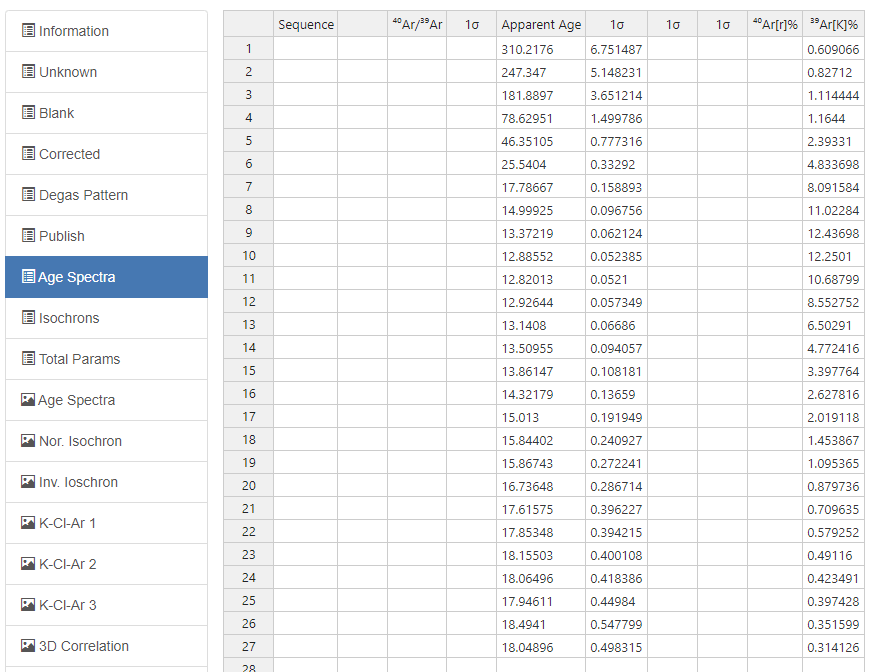
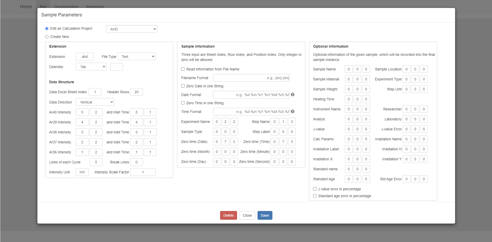

*本文档最新更新于 **2024年2月15日***

[English](/Tutorial.md)

## 目录

1. [基本流程](#基本流程)
2. [导入数据](#导入数据)
3. [设置原始文件过滤器](#设置原始文件过滤器)
4. [设置计算常数集](#设置计算参数集)
5. [设置辐照参数](#设置辐照参数)
6. [设置样品信息及特殊参数](#设置样品信息及特殊参数)
7. [矫正及再计算](#矫正及再计算)
8. [与表格的交互](#与表格的交互)
9. [与图形的交互](#与图形的交互)
10. [保存及导出](#保存及导出)
11. [FAQ](https://github.com/wuyangchn/webarar/issues)

## 基本流程

WebArAr 以 Sample 为操作对象，每份导入数据都将创建响应的 Sample 对象，其本质为 Python 类对象的示例。交互页面中用户对 Sample 对象的更改被发送到服务器端进行同步，服务器端将计算结果发送到前端显示。

### 创建并打开 Sample

创建 Sample 对象有以下四种方式：

1. 读取质谱仪输出的原始文件：

    - 原始文件记录了质谱仪在一定时间间隔内测量的信号量，通常需要至少包括以下信息：零时刻时间，测量时间，测量时间响应的信号量。

    - 需要预先设置好文件过滤器。参见[设置原始文件过滤器](#设置原始文件过滤器)。
    
    - 读取原始文件后需要选择适当的拟合方法计算外推到零时刻时的信号量，并为为每个样品阶段指定本底。参见[导入原始数据](#导入原始数据)。

2. 打开 .arr 文件：

    - .arr 文件是WebArAr保存文件时的格式，但并非专用格式，实质上是 JSON 序列化后的 Sample 实例。

3. 打开 ArArCALC 软件相关的 .age 文件或其导出的 .xls 文件：

    - .xls 文件相比 .xls 文件丢失了部分信息。

4. 创建空白对象：

    - 创建空白对象将支持由用户手动输入数据。

    - 通常当只需要利用 WebArAr 的部分功能时，创建空白对象比较方便。例如，只需要绘制等时线，则只需要传入响应的同位素比值。参见[创建空白对象](#创建空白对象)

### 打开 Sample 后

成功创建样本对象后，将进入对象显示页面。

左侧导航栏列出该对象拥有的表格和图形。[图表内容](#图表内容)介绍了各个图表中的详细内容。

已打开的任何文件都将不再与用户的本地文件有关联，因此不用担心操作会造成本地数据丢失。此外，Sample 对象以数据流的形式在服务器端和用户端之间传递，不会自动形成文件，因此，除非用户下载 .arr 文件，否则关闭窗口时将丢失所有操作。

在对象显示页面可以进行如下操作：

1. 修改样品信息：
    
    采样地点、实验室、研究人员等信息可在 Information 修改，这些与计算无关。

2. 编辑修改表格内容：

    所有的表格都是可编辑的，编辑后需要点击下方 Save changes 以保存修改。

3. 编辑参数：

    **注意：修改参数后不会自动调用计算，需要用户根据需要触发重新计算。参见[重新计算](#重新计算)。**

    - Total Param 包括了所有参数，编辑该表格并保存可以设置新的参数。

    - 通过下方的 Irra Params、Calc Params 和 Smp Params 为所有阶段选择预先设定好的参数集，或手动输入参数。三组参数的内容可以参见[参数设置](#参数设置)

4. 与图形的通用交互

    所有的图形都由Echarts渲染，因此具备Echarts的特征和属性。

    - 点击顶部的图例按钮，可以隐藏或显示响应的图形元素，如线、点或文字。
    
    - 文字可以被拖拽以移动位置。

    - 点击底部的 Style 按钮，可以设置当前显示的图件的属性信息，如坐标范围、线宽、颜色、字号等。打开 Style 窗体后，默认显示的时坐标轴相关的属性。鼠标点击图形中的元素，如文字、直线等，可以设置相应元素的属性。

5. 等时线中选择散点以拟合等时线

    WebArAr提供了五个等时线，包括正反等时线和三个与氯相关的等时线。所有等时线和年龄谱图将使用相同的阶段选择组合，最多支持两种选择组合，即 Set1 和 Set2。
        
    Set1 和 Set2 由右侧的两个单选按钮切换。Set1为红色，Set2为蓝色。点击散点可以选择或取消选择阶段数据点。通常，
    
    每次点击都会自动重新计算回归和年龄，响应速度与网络速度有关。为了方便操作，可以在按住 Ctrl 键后，连续点击多个数据点，这时不会自动重新计算，之后需要触发重新计算，或松开 Ctrl 的情况下再点击一个散点。

## 界面

*Home Page*

*Import Data Page*

*Object Page*

*Tables*

*Figures*

## Import your data

## Import from mass spec raw data

To set file filter, see [here](#setting-file-filter)

## Open arr file

see [arr file example](22WHA0433.arr)

## Import from ArArCALC

.age files, see [age file example](22WHA0433.age)

.xls files, see [xls file example](22WHA0433.full.xls)

## The current file

The redis will save your last opened object for a while, via The Current File you can get it without uploding the file again.

## Create an empty object

Create an empty object and you will need to enter data in the appropriate tables. What data is required is dependant on your needs, WebArAr will do whatever it can do.

For example, if you want to plot a age speatra. Paste data into 'Apparent Age', '1σ', and '39Ar[K]%' columns in the 'Age Spectra table', then click 'Sava changes'.

Then click 'Recalcualte' and select 'Reset Plot Data' and 'Reset Figure Style' and apply.
The age spectra plot shows.

## Setting file filter

## Setting constants set

## Setting irradiation parameters

## Setting sample imformation and parameters

## Data reduction and recalculation

## Interact with tables

## Interact with plots

## Save and export

